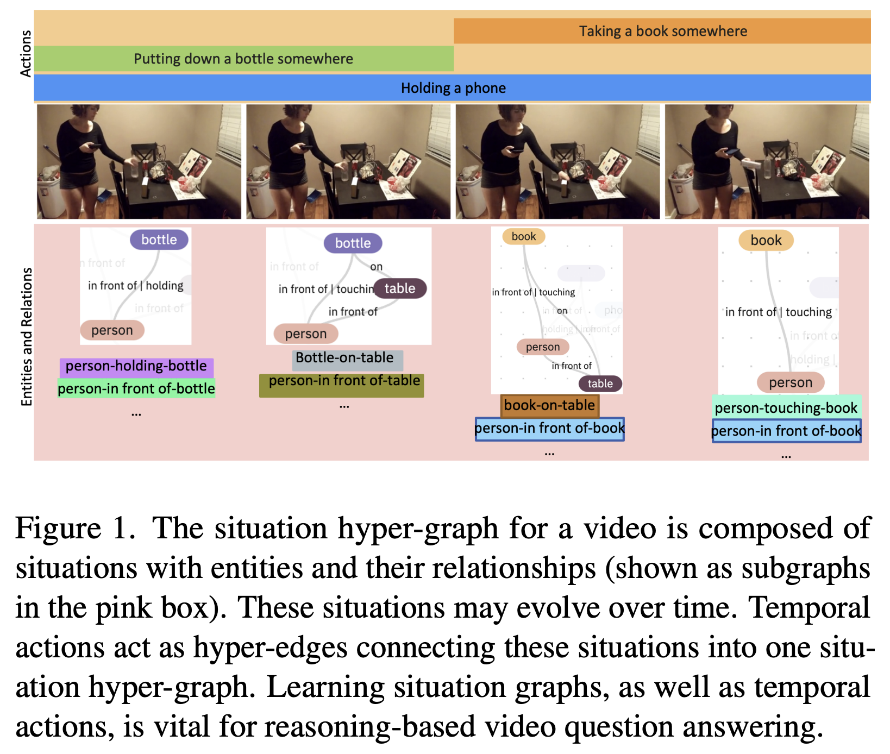

# SHG-VQA
Learning Situation Hyper-Graphs for Video Question Answering [CVPR 2023]

[Aisha Urooj Khan](https://scholar.google.com/citations?view_op=list_works&hl=en&hl=en&user=ceiuCp4AAAAJ), [Hilde Kuehne](https://hildekuehne.github.io/), [Bo Wu](https://scholar.google.com/citations?user=6ozI_ZMAAAAJ&hl=en), Kim Chheu, Walid Bousselhum, [Chuang Gan](https://people.csail.mit.edu/ganchuang/), [Niels Da Vitoria Lobo](https://www.crcv.ucf.edu/person/niels-lobo/), [Mubarak Shah](https://www.crcv.ucf.edu/person/mubarak-shah/)

[`Website`]() | [`Paper`](https://arxiv.org/abs/2304.08682) | [`BibTeX`](#citation)

Official Pytorch implementation and pre-trained models for Learning Situation Hyper-Graphs for Video Question Answering (coming soon).

## Abstract
Answering questions about complex situations in videos requires not only capturing the presence of actors, objects,
and their relations but also the evolution of these relationships over time. A situation hyper-graph is a representation that describes situations as scene sub-graphs for video frames and hyper-edges for connected sub-graphs and has been proposed to capture all such information in a compact structured form. In this work, we propose an architecture for Video Question Answering (VQA) that enables answering
questions related to video content by predicting situation hyper-graphs, coined Situation Hyper-Graph based Video Question Answering (SHG-VQA). To this end, we train a situation hyper-graph decoder to implicitly identify graph representations with actions and object/human-object relationships from the input video clip. and to use cross-attention between the predicted situation hyper-graphs and the question embedding to predict the correct answer. The proposed method is trained in an end-to-end manner and optimized by
a VQA loss with the cross-entropy function and a Hungarian matching loss for the situation graph prediction. The effectiveness of the proposed architecture is extensively evaluated on two challenging benchmarks: AGQA and STAR. Our results show that learning the underlying situation hypergraphs helps the system to significantly improve its performance for novel challenges of video question-answering task.

<p align="center">

</p>

### Proposed SHG-VQA Architecture
<p align="center">

</p>


### Datasets
We report results on two reasoning-based video question answering datasets: [AGQA](https://cs.stanford.edu/people/ranjaykrishna/agqa/) and [STAR](https://bobbywu.com/STAR/). 

Instructions to preprocess AGQA and STAR (to be added)

#### AGQA
Download train and val split for the balanced version of AGQA 2.0 we used in our experiments from [here](https://drive.google.com/file/d/17_rqCnR9whlXRPd9RfubhPUP8oLCFD4b/view?usp=sharing).

##### Compilation Instructions
1. Download our data from above.
2. Download the Charades videos and frames.
3. Check the README.md files in each directory (```AGQA/data``` and ```AGQA/annotations```) to see where each file 
   should be kept.
4. Open ```AGQA/src/tasks/agqa_data.py``` and locate the "todo"s. Change the paths of the root and annotations directory to match yours.

##### Training 
For the full model, run ```agqaHGQA.py```. For the question-only and video-question-only models, run ```agqaQ.py``` and ```agqaVQA.py``` respectively.

* The following flags are used for the full model:
    ```
    --train train --valid valid --llayers 5 --xlayers 2 --rlayers 5 \
    --noCaps --crossAttnType cross --batchSize 32 --optim bert --lr 1e-5 --taskHGQA \
    --fromScratch --LossHGPerFrame --epochs 100 --tqdm --output path/to/output/files \
    --augmentType rand_aug --backbone slow_r50 --multiGPU
    ```
* For the question-only or video-question-only models:
    * Change the ```--taskHGQA``` to ```--taskQ``` or ```--taskVQA```
 
* For AQGA's test splits, models are trained as follows:
   * Indirect References: This split is trained using the full model
   * Novel Compositions: Add a ```--novelComp``` flag
   * More Compositional Steps: Add a ```--compSteps``` flag


##### Evaluation
* The following flags are used for evaluating the full model:
  ```
  --test test --llayers 5 --xlayers 2 --rlayers 5 \ 
  --noCaps --LossHGPerFrame --crossAttnType cross --batchSize 8 --optim bert --lr 1e-5 --taskHGQA \
  --fromScratch --indirectRef --epochs 100 --tqdm --output path/to/output/files \
  --augmentType no_aug --backbone slow_r50 --load path/to/saved/model --multiGPU
  ```

* To test AQGA's different test splits:
    * Indirect References: Keep the ```--indirectRef``` flag, load the full model's ```.pth```
    * Novel Compositions: Change to ```--novelComp```, load the ```.pth``` from training the novelComp model 
    * More Compositional Steps: Change to ```--compSteps```, load the ```.pth``` from training the compSteps model 
    
    * **Note:** ```--indirectRef``` will evaulate both the full model and the indirect references split together
   
     

#### Pre-Processing
##### Questions:
* We randomly sampled 10% of questions from the training set to be used for the validation set
* Train/Valid/Test files are formatted as a list of dictionaries, containing all information given by AGQA.
    * Format: 
    ```
    [{
    "question": "Before starting to open a bag, what was the person taking?",
     "answer": "paper", 
     "video_id": "3ZUVI", 
     "global": ["obj-rel"], 
     "local": "v023", 
     "ans_type": "open", 
     "steps": 4, 
     "semantic": "object", 
     "structural": "query", 
     "novel_comp": 0, 
     "more_steps": 0, ...}]
     ```

##### Answers:
* We iterated through all ground-truth answers in the training/validation set to get all answer choices.
* All possible answers are mapped to an index and stored in the answer vocab.
    * Format: `{"answer1": 0, "answer2": 1, ...}`


##### Video Frames:
* Download the videos and their frames from the Charades dataset.
* We randomly sampled a fixed clip-len from these frames.
    * trimmed_frame_ids.json file:
        * Contains pre-trimmed and sampled frames of clip length 16
        * Format: 
        ```
        {
        vid_id1: [frame#, frame#,...],
        vid_id2: [frame#, frame#,...],
        ...}
        ```

##### Triplets:
* AGQA provides "scene graphs" and object/relationships/action classes.
* We iterated through the given scene graphs for each video's frame and created triplets in the form of: (person, relation, object)
    * frameTriplets.json:
        * Format: 
        ```
        {
        vid_id: {frame#: [(triplet), (triplet)], 
                 frame#: [(triplet), (triplet)]},
                 ...}
        ```

* For the given action classes, we list all actions found in each video frame.
    * frameActions.json:
        * Format: 
        ```{
                     vid_id: {frame#: [(action), (action)], 
                              frame#: [(action)]
                              },
                  ...} 
      ```

* All unique triplets and actions are mapped to an index for easy reference in the code.
    * relationship_triplets.json: `{(triplet): 0, (triplet): 1, ...}`
    * action_dictionaries.json: `{action: 0, action: 1, ...}`

#### STAR
On STAR dataset, SHG-VQA was trained separately for each question type: Feasibility, Prediction, Interaction, and Sequence.
Download the data from https://bobbywu.com/STAR/. The processed data files can be found at [data](https://github.com/aurooj/SHG-VQA/tree/main/data). Train-val-test splits are [here](https://github.com/aurooj/SHG-VQA/blob/main/data/read.md).


##### Training
For training, run the following commands:
```
cd AGQA/

```
1) To train on Feasibility questions:
```
CUDA_VISIBLE_DEVICES=0,1 python src/tasks/star.py --train train --valid val --llayers 5 --xlayers 2 --rlayers 5 \
  --noCaps --crossAttnType cross --batchSize 8 --optim bert --lr 1e-5 --taskHGQA --useHGMask \
   --epochs 100 --tqdm --output snap/star/star_randaug_hgqa_feas_sep_all --qType Feasibility \
   --qaArrangeType add_sep_all --augmentType rand_aug --backbone slow_r50 --LossHGPerFrame --multiGPU
```
2) To train on Prediction questions:
```
CUDA_VISIBLE_DEVICES=0,1 python src/tasks/star.py --train train --valid val --llayers 5 --xlayers 2 --rlayers 5 \
  --noCaps --crossAttnType cross --batchSize 8 --optim bert --lr 1e-5 --taskHGQA --useHGMask \
   --epochs 100 --tqdm --output snap/star/star_randaug_hgqa_pred_sep_all --qType Prediction \
   --qaArrangeType add_sep_all --augmentType rand_aug --backbone slow_r50 --LossHGPerFrame --multiGPU

```

3) To train on Interaction questions:
```
   CUDA_VISIBLE_DEVICES=0,1 python src/tasks/star.py --train train --valid val --llayers 5 --xlayers 2 --rlayers 5 \
  --noCaps --crossAttnType cross --batchSize 8 --optim bert --lr 1e-5 --taskHGQA --useHGMask \
   --epochs 100 --tqdm --output snap/star/star_randaug_hgqa_interaction_sep_all --qType Interaction \
   --qaArrangeType add_sep_all --augmentType rand_aug --backbone slow_r50 --LossHGPerFrame --multiGPU
```
4) To train on Sequence questions:

 ```
 CUDA_VISIBLE_DEVICES=0,1 python src/tasks/star.py --train train --valid val --llayers 5 --xlayers 2 --rlayers 5 \
  --noCaps --crossAttnType cross --batchSize 8 --optim bert --lr 1e-5 --taskHGQA --useHGMask \
   --epochs 100 --tqdm --output snap/star/star_randaug_hgqa_seq_sep_all --qType Sequence \
   --qaArrangeType add_sep_all --augmentType rand_aug --backbone slow_r50 --LossHGPerFrame --multiGPU
```

##### Testing
Run the following commands to test the trained model for each question type respectively:
1) For Feasibility:
```
python src/tasks/star.py --train train --valid "" --test test --llayers 5 --xlayers 2 --rlayers 5 \
  --noCaps --crossAttnType cross --batchSize 8  --taskHGQA --useHGMask \
   --load snap/star/star_randaug_hgqa_feas_sep_all/BEST --tqdm --output snap/star/star_randaug_hgqa_feas_sep_all --qType Feasibility \
   --qaArrangeType add_sep_all --augmentType no_aug --backbone slow_r50
```

2) For Prediction:
```
python src/tasks/star.py --train train --valid "" --test test --llayers 5 --xlayers 2 --rlayers 5 \
  --noCaps --crossAttnType cross --batchSize 8   --taskHGQA --useHGMask \
   --load snap/star/star_randaug_hgqa_pred_sep_all/BEST --tqdm --output snap/star/star_randaug_hgqa_pred_sep_all --qType Prediction \
   --qaArrangeType add_sep_all --augmentType no_aug --backbone slow_r50
```

3) For Interaction:
```
  python src/tasks/star.py --train train --valid "" --test test --llayers 5 --xlayers 2 --rlayers 5 \
  --noCaps --crossAttnType cross --batchSize 8  --taskHGQA --useHGMask \
  --load  snap/star/star_randaug_hgqa_interaction_sep_all/BEST --tqdm --output snap/star/star_randaug_hgqa_interaction_sep_all --qType Interaction \
   --qaArrangeType add_sep_all --augmentType no_aug --backbone slow_r50
```

4) For Sequence:
```
python src/tasks/star.py --train train --valid "" --test test --llayers 5 --xlayers 2 --rlayers 5 \
  --noCaps --crossAttnType cross --batchSize 8  --taskHGQA --useHGMask \
  --load  snap/star/star_randaug_hgqa_seq_sep_all/BEST --tqdm --output snap/star/star_randaug_hgqa_seq_sep_all --qType Sequence \
   --qaArrangeType add_sep_all --augmentType no_aug --backbone slow_r50
```

### Citation
If this work and/or its findings are useful for your research, please cite our paper.

```bibtex
@InProceedings{Urooj_2023_CVPR,
    author    = {Urooj, Aisha and Kuehne, Hilde and Wu, Bo and Chheu, Kim and Bousselham, Walid and Gan, Chuang and Lobo, Niels and Shah, Mubarak},
    title     = {Learning Situation Hyper-Graphs for Video Question Answering},
    booktitle = {Proceedings of the IEEE/CVF Conference on Computer Vision and Pattern Recognition (CVPR)},
    month     = {June},
    year      = {2023},
    pages     = {14879-14889}
}
```

### Questions?
Please contact 'aishaurooj@gmail.com'
